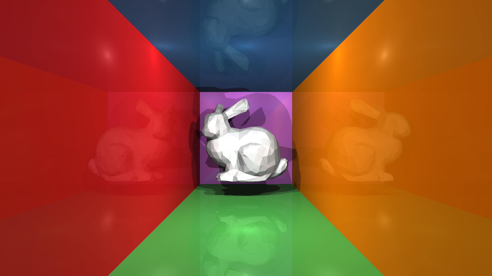

# CUDA Ray Tracing

*Learning about cuda with ray tracing*


***4K Bunny!!! Ray Traced in lighting speed***

(for real...😅 the CPU version for 360p took 90 seconds)

## Requirements

- CMake 3.11
- CUDA Toolkit (Any modern version should work)
- Currently Targeting GPU with compute capability 8.6 (My GPU)

**Note:** If you are using a different GPU, you will need to change `ARCH_CODE`
in [CMakeLists.txt](CMakeLists.txt) to target your GPU. Or simple comment our all lines referencing `ARCH_CODE` and let *nvcc* auto detect your GPU.

## Features and TODOs

**⚠️ The project is still in development ⚠️**

- [x] Parallel Ray Tracing
- [x] Real-Time Ray Tracing (*for simple and lower resolution scene*)
- [x] CPU Recursive BVH Construction
- [ ] Parallel Iterative BVH Traversal- [Same Author's Blog](https://developer.nvidia.com/blog/thinking-parallel-part-iv-prefix-sums/)
- [ ] Parallel BVH Construction - **Linear BVH** [Original Author's Blog](https://developer.nvidia.com/blog/thinking-parallel-part-iii-tree-construction-gpu/)
- [x] Flexible Scene Configuration with JSON and .stl (see [data](data) folder)

**Note:** CPU BVH construction and Blinn-Phong Shading are Naively implemented. Major improvement is possible from current results.

### Down the line

Will probably not get to all of them, but hopefully most 😎👌

- [ ] Refraction
- [ ] Soft Shadows
- [ ] Global Illumination
- [ ] Anti-Aliasing
- [ ] Transparency and Opacity
- [ ] Depth of Field
- [ ] Caustics
- [ ] Volume Scattering
- [ ] Interactive Real-Time Ray Tracing
- [ ] [Fast Parallel BVH
  reconstruction](https://research.nvidia.com/publication/2013-07_fast-parallel-construction-high-quality-bounding-volume-hierarchies)

## Quick Start

❗ Since BVH Traversal is not completly implemented. Planes are not rendered. use `--no-bvh` to turn off BVH for plane rendering.

### VSCode

- Open command palette `(Ctrl+Shift+P)` then select `Tasks: Run Test`
- After build it will run the binary automatically.
- You can see `raytracing` and `rgb.png` in [build-release](build-release) folder for the binary.

### Manual

```bash
# cd to project root
mkdir build-release -p 
cd build-release 
cmake -DCMAKE_BUILD_TYPE=Release .. # or just cmake .. for debug build
make

./raytracing
```

## Help

```bash
$ ./raytracing --help

Usage: raytracing [OPTION...]
            [-f FILE='../data/bunny.json'] [-b SIZE=16] [-r RESOLUTION=720]
            [--no-bvh] [-o FILE='rgb.png']
Real-Time Ray Tracing with CUDA.

Involve parallel Ray Tracing and parallel BVH construction. (WIP)
Intend to provide interactive component for ray tracing.

  -b, --blocksize=SIZE       Block size for CUDA processing. Default: 16 x 16 
  -f, --filename=FILE        Path to the Scene JSON config file. Default:
                             ../data/bunny.json
      --no-bvh               Turn off Ray Tracing with BVH. Default: BVH is ON
  -o, --output=FILE          Output file name. We only support .png and .ppm
                             format. Default: rgb.png
  -r, --resolution=RESOLUTION   Resolution of the output image (e.g. 360, 720,
                             1080). Default: 720
  -?, --help                 Give this help list
      --usage                Give a short usage message
  -V, --version              Print program version

Mandatory or optional arguments to long options are also mandatory or optional
for any corresponding short options.

Report bugs to hxr.richard@gmail.com.
```

## Scene Configuration and Current Results

```
$ ./raytracing -r 360 

Resolution:    640 x 360
Block size:    10 x 6 
Grid size:     64 x 64
Time:          34.9327 ms
Throughput:    6.5955 M rays/s
FPS:           28.6264 fps     <------------ ~30 fps :)
Scene size:    68484 bytes
# of objects:  1000
# of lights:   4
BVH enabled:   True

Writing image to rgb.png
```
